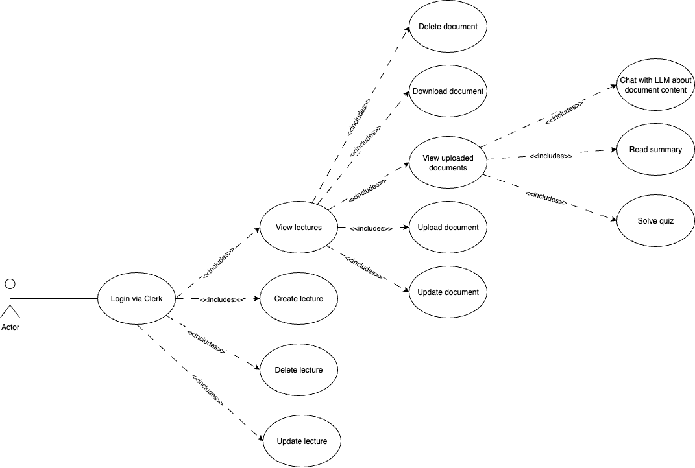
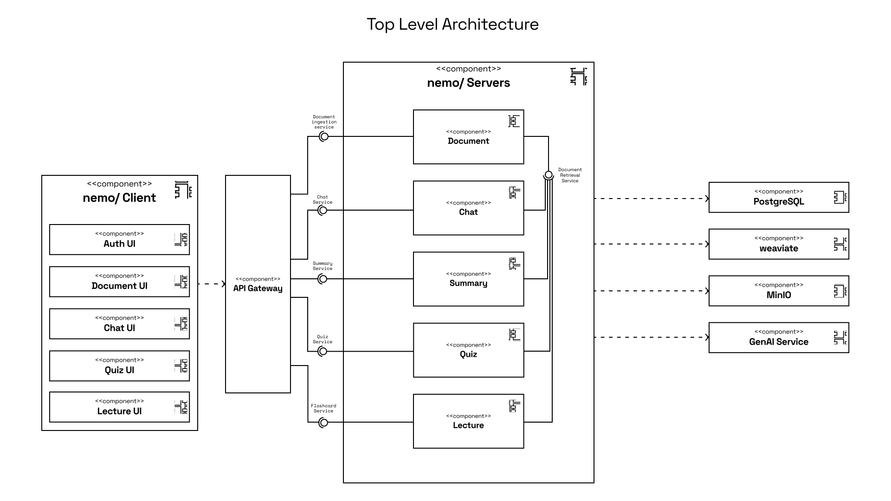

# Nemo - an AI-Powered Study Assistant
This project is a study companion designed to make exam preparation more interactive and efficient. It combines generative AI with a clean document structure to help break down complex topics and support deeper understanding.

Students can organize their materials into lectures (essentially folders), upload slides or documents for each lecture, and receive an AI-generated summary, quiz questions, and a personalized chat interface per document.

## What It Does
The application helps students study smarter by turning their lecture content into something more interactive. It gives students a focused way to prepare without having to dig through long PDFs or take extensive notes on their own. Here’s what it offers:
**Lecture-Based Organization**
Students can create lectures (which act like folders) and upload multiple documents or slide decks to each one.
**AI Support**
Each uploaded file gets its own set of tools:
	•	A concise summary that covers the main points.
	•	Quiz questions generated from the content, so the students can test themselves.
	•	A chat interface that lets the students ask questions about that document and get relevant answers from the AI.

## Integration of Generative AI
Behind the scenes, the application uses three separate Python microservices to process and work with the uploaded documents:
1.	Chat Service
This service powers the interactive Q&A feature. When a student asks a question about a specific document, the system looks through that document’s content (broken into smaller chunks and stored in a vector database) to find the most relevant parts. It also keeps track of previous messages to respond in a way that fits the ongoing conversation.
2.	Summary Service
When a document is uploaded, this service creates a short summary that captures the main ideas. It’s helpful for quick reviews or getting an overview before diving into the details.
3.	Quiz Service
This one reads through the content of a slide deck or document and creates quiz questions from it. The questions are meant to help students actively test what they’ve understood so far.

## Functional Scenarios
**AI Summary Generation**:
A student uploads slides from a lecture on “Network Security”. The summary service processes the slides and provides a concise overview of the key topics, including cryptographic protocols, threats, and countermeasures.

**Slide-Specific Questioning**:
After reviewing the slides, a student feels uncertain about one topic and asks, “Can you explain the difference between symmetric and asymmetric encryption?” The chat service responds with a detailed answer based on the relevant slide content, maintaining context from earlier questions in the conversation.

**Knowledge Assessment through Quizzing**:
To check their understanding, the student switches over to the quiz feature. The quiz service generates multiple questions about the uploaded slides.

# Components and Responsibilities (System Design)
## 1. Frontend (React, Vite, TypeScript, ShadCN, TailwindCSS)
### Responsible Students:
Maria Pospelova, Alexander Steinhauer, Simon Huang

### Core Functionality
**Clerk-based Authentication** \
Users log in securely using Clerk.

**Lecture Management** \
Users can view, create, update, and delete their own lectures.

**Document Upload and Editing** \
For each lecture, users can upload documents (e.g., slide decks) and optionally set a display name and description during the upload process. Each document can later be downloaded, renamed, or removed.

**Interactive Study Interface** \
Once a document is uploaded, users can switch between three tabs:
•	_Summary_ – View an AI-generated summary of the content
•	_Quiz_ – Practice with automatically generated questions
•	_Chat_ – Ask questions directly to the LLM about the content for clarification

## 2. API Gateway (nginx)
### Responsible Students:
Alexander Steinhauer

### Core Functionality
**Service Routing** \
Routes API requests to appropriate backend services (chat, documents, lectures, quiz, summary).

## 3. Document Microservice (Spring Boot)
### Responsible Students:
Simon Huang

### Core Functionality
**Chunking & Embedding** \
Uploaded documents are split into smaller, manageable chunks. These chunks are then embedded and stored in a Weaviate vector database.

**Metadata Management** \
Supports full CRUD operations (create, read, update, delete) for document metadata using a PostgreSQL database.

**Similarity Search** \
Provides an endpoint for retrieving document chunks most relevant to a given user query. Used primarily by the chat microservice to generate context-aware responses.

## 4. Lecture Microservice (Spring Boot)
### Responsible Students:
Maria Pospelova

### Core Functionality
**Lecture Management** \
Provides full CRUD operations for lectures, allowing users to create, update, delete, and view their own lecture folders.

**Document Association** \
Each uploaded document is linked to a specific lecture. This ensures that documents are organized and can be retrieved or displayed in the correct lecture context.

## 5. Chat Microservice (Python with FastAPI + LangChain )
### Responsible Students:
Maria Pospelova

### Core Functionality
**RAG-based AI Chat** \
Combines OpenAI’s GPT model with a Retrieval-Augmented Generation (RAG) approach. Relevant document chunks are retrieved based on user queries and paired with recent conversation history to generate context-aware responses.

**Document Integration** \
Performs similarity search on document chunks by connecting to document microservice.

## 6. Summary Microservice (Python with FastAPI + LangChain )
### Responsible Students:
Maria Pospelova

### Core Functionality
**AI-Powered Document Summarization** \
Generates structured summaries using OpenAI’s GPT model, targeting 10–20% of the original length. Uses markdown for formatting.

**Document Integration** \
Combines all document chunks into a single text while preserving context and structure to ensure accurate summarization.

## 7. Quiz Microservice (Python with FastAPI + Langchain)
### Responsible Students:
Alexander Steinhauer

## 8. Database (PostgreSQL)
### Responsible Students:
Simon Huang

`lecture_db`: Stores lecture objects. \
`document_db`: Stores document metadata. Has reference to corresponding lecture. Chat conversation is stored here as well.

## 9. Vector Database (Weaviate)
### Responsible Students:
Simon Huang

### Core Functionality
Stores embedded chunks created from uploaded PDF documents. The chunks are used by chat microservice, summary microservice, and quiz microservice.

## 10. Document File Storage (Minio)
### Responsible Students:
Simon Huang

### Core Functionality
Stores PDF files belonging to uploaded documents. The documents can be downloaded from here.

## 11. DevOps
### Responsible Students:
Alexander Steinhauer, Simon Huang

### Core Functionality
- a
- a
- a

## 13. Authentication (Clerk)
### Responsible Students:
Alexander Steinhauer

### Core Functionality
Manages secure user login via email and code.

## Technologies
| Component              | Technology                                |
|------------------------|--------------------------------------------|
| Frontend               | React, Vite, ShadCN, TailwindCSS   |
| API Gateway            | nginx                                     |
| Document Microservice  | Spring Boot, Java                         |
| Lecture Microservice   | Spring Boot, Java                         |
| Chat Microservice      | Python, FastAPI, LangChain                |
| Summary Microservice   | Python, FastAPI, LangChain                |
| Quiz Microservice      | Python, FastAPI, LangChain                |
| Database               | PostgreSQL                                |
| Vector Database        | Weaviate                                  |
| Document File Storage  | Minio                                     |
| DevOps                 | Docker, Kubernetes, CI/CD (e.g. GitHub Actions) |
| Authentication         | Clerk                                     |

# API Documentation

## Document Service (`/api/documents`)
- `GET /api/documents/` - Get all documents (optional `lectureId` query param)
- `POST /api/documents/upload` - Upload a new document (multipart form data)
- `GET /api/documents/{id}` - Get document by ID
- `PUT /api/documents/{id}` - Update document metadata
- `DELETE /api/documents/{id}` - Delete document
- `GET /api/documents/{id}/download` - Download document file
- `GET /api/documents/search/similar` - Find similar documents using vector similarity
- `GET /api/documents/{id}/chunks` - Get all chunks for a document
- `POST /api/documents/{id}/conversation` - Add message to document conversation
- `DELETE /api/documents/{id}/conversation` - Clear document conversation
- `DELETE /api/documents/lecture/{lectureId}` - Delete all documents for a lecture

## Lecture Service (`/api/lectures`)
- `GET /api/lectures/health` - Health check endpoint
- `POST /api/lectures` - Create a new lecture
- `GET /api/lectures/user/{userId}` - Get lectures by user ID
- `GET /api/lectures/{id}` - Get lecture by ID
- `PUT /api/lectures/{id}` - Update lecture
- `DELETE /api/lectures/{id}` - Delete lecture
- `GET /api/lectures` - Get all lectures

## Chat Service (`/api/chat`)
- `GET /api/chat/health` - Health check endpoint
- `POST /api/chat` - Send a message and get AI response
  - Request body: `{ "message": string, "document_id"?: string }`
- `GET /api/documents/{document_id}` - Get document information

## Summary Service (`/api/summary`)
- `GET /api/summary/health` - Health check endpoint
- `POST /api/summary` - Generate document summary
  - Request body: `{ "document_id": string }`
  - Returns AI-generated summary of document content

## Quiz Service (`/api/quiz`)
- `GET /api/quiz/health` - Health check endpoint
- `POST /api/quiz/generate` - Generate quiz questions for a document
  - Request body: `{ "document_id": string }`
  - Returns AI-generated quiz questions based on document content

All endpoints are accessed through the API Gateway running on port 8080. Authentication is handled via Clerk, and appropriate authentication headers must be included with requests.

# Requirements

## Functional Requirements

### User Management
- Users can sign up and log in securely using Clerk authentication

### Lecture Management
- Users can create, view, update, and delete lectures
- Users can organize multiple documents within each lecture

### Document Management
- Users can upload PDF documents and slide decks
- Users can view, rename, and delete uploaded documents
- Users can download original documents
- Users can edit document metadata (name, description)

### AI-Powered Features
- System generates concise summaries of uploaded documents (10-20% of original length)
- System creates interactive quiz questions from document content
- Users can engage in context-aware chat about specific documents
- Chat system maintains conversation history per document
- System provides relevant answers based on document content using RAG

### Navigation
- Users can navigate between lectures and their contained documents

## Non-Functional Requirements
### Performance
- API Gateway handles routing with minimal latency
- Vector similarity search returns results in under 2 seconds
- Document upload and processing completes within reasonable time

### Scalability
- Microservices architecture enables independent scaling
- Docker containerization supports easy deployment
- Kubernetes-ready for cloud deployment
- Separate databases per service for independent data storage

### Security
- Clerk-based authentication for all endpoints
- Secure document storage in MinIO
- Cross-Origin Resource Sharing (CORS) configured
- Environment variables for sensitive configuration

### Reliability
- Health check endpoints for all services
- Prometheus metrics for monitoring
- Grafana dashboards for visualization
- Error handling and logging across services

### Maintainability
- Clear separation of concerns via microservices
- Consistent code style and organization
- Comprehensive API documentation
- Docker Compose for local development
- Makefile for common operations

### Data Management
- Vector embeddings for semantic search (Weaviate)
- Efficient document chunking for RAG
- Persistent conversation history
- Secure file storage (MinIO)
- Relational data in PostgreSQL

# Monitoring and Observability
Nemo implements comprehensive monitoring using Prometheus and Grafana, providing real-time observability across all microservices.

## Prometheus Configuration
Prometheus is configured to scrape metrics from all services every 15 seconds, with a 10-second timeout. The configuration is defined in `build/config/prometheus/prometheus.yml`.

### Exception Rules
Exception monitoring is configured in `build/config/prometheus/exception_rules.yml` with two main alert types:

1. **High5xxErrorRate**:
   - Triggers immediately when 5xx errors are detected

2. **High4xxErrorRate**:
   - Triggers immediately when 4xx errors are detected

## Grafana Dashboards
Grafana provides visualization of metrics through several specialized dashboards:

### AI Usage Dashboard (`ai_usage.json`)
Monitors AI service performance and usage:
- Token usage rate by type (prompt, completion, total)
- Total AI requests counter
- AI request success rate with thresholds
- Total tokens used across all services

### Service Exceptions Dashboard (`exceptions.json`)
Tracks error rates and exceptions:
- HTTP 5xx error rates by service
- HTTP 4xx error rates by service
- Error log rates including AI failures
- Real-time error tracking with service breakdown

### Health Check Dashboard (`health.json`)
Basic service health monitoring:
- Service uptime tracking
- Service availability status
- Health check endpoint monitoring

### HTTP Requests Dashboard (`http_requests.json`)
General HTTP traffic monitoring:
- Request count by service
- Request duration metrics
- Request rate tracking

# Architecture Overview
#### Use Case Diagram


#### UML Class Diagram
This class diagram shows the relationships between objects in the application


#### Top-Level Architecture
This diagram shows the top level architecture


#### Analysis Object Model
This diagram shows the analysis object model


# Setup Instructions for Local Development
## Prerequisites

- [Docker](https://www.docker.com/get-started) for running the server
- [Bun](https://bun.sh/) for running the client

## Clone Repository
```
https://github.com/AET-DevOps25/team-sigma.git
cd team-sigma
```
## Running the Project
### Setup
Add an OpenAI key for Weaviate, chat microservice, quiz microservice, and summary microservice to the `.env` file:

```
export OPENAI_API_KEY=sk_xxx
```

### Client
Navigate to the client directory and start the development server:

```bash
cd client
bun i
bun dev
```

The client application should now be accessible at http://localhost:5713.

### Server
Start the server services using our Makefile in root directory:
```bash
make run
```
This command uses Docker Compose to start all the necessary services:
- **Core Services**:
  - API Gateway (nginx) - Routes requests on port 8080
  - Document Service (Spring Boot) - Handles document management and processing
  - Lecture Service (Spring Boot) - Manages lecture organization
  - Chat Service (Python/FastAPI) - Provides AI chat functionality
  - Summary Service (Python/FastAPI) - Generates document summaries
  - Quiz Service (Spring Boot) - Creates quiz questions
  - Client (React) - Serves the frontend on port 3000

- **Infrastructure Services**:
  - Weaviate - Vector database for document embeddings (port 8090)
  - MinIO - Object storage for PDF files (ports 9000, 9001)
  - PostgreSQL - Relational database (port 5432)
  - Prometheus - Metrics collection (port 9090)
  - Grafana - Metrics visualization (port 3001)

# Application Screenshots
#### Lectures


#### Documents


#### Summary Tab


#### Chat Tab
